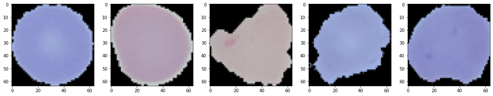

```python
import numpy as np
np.random.seed(1000)
import pandas as pd
import matplotlib.pyplot as plt
%matplotlib inline

import os
import cv2
from PIL import Image

os.environ['KERAS_BACKEND'] = 'tensorflow' # Added to set the backend as Tensorflow
from sklearn.model_selection import train_test_split
import keras
from keras.layers import Convolution2D, MaxPooling2D, Flatten, Dense, BatchNormalization, Dropout
from keras.models import Sequential
```


```python
from tensorflow.keras.utils import to_categorical
```


```python
DATA_DIR = 'Downloads/archive/cell_images/'
SIZE = 64
dataset = []
label = []
```


```python
parasitized_images = os.listdir(DATA_DIR + 'Parasitized/')
for i, image_name in enumerate(parasitized_images):
    try:
        if (image_name.split('.')[1] == 'png'):
            image = cv2.imread(DATA_DIR + 'Parasitized/' + image_name)
            image = Image.fromarray(image, 'RGB')
            image = image.resize((SIZE, SIZE))
            dataset.append(np.array(image))
            label.append(0)
    except Exception:
        print("Could not read image {} with name {}".format(i, image_name))
```


```python
uninfected_images = os.listdir(DATA_DIR + 'Uninfected/')
for i, image_name in enumerate(uninfected_images):
    try:
        if (image_name.split('.')[1] == 'png'):
            image = cv2.imread(DATA_DIR + 'Uninfected/' + image_name)
            image = Image.fromarray(image, 'RGB')
            image = image.resize((SIZE, SIZE))
            dataset.append(np.array(image))
            label.append(1)
    except Exception:
        print("Could not read image {} with name {}".format(i, image_name))
```


```python
plt.figure(figsize = (20, 12))
for index, image_index in enumerate(np.random.randint(len(parasitized_images), size = 5)):
    plt.subplot(1, 5, index+1)
    plt.imshow(dataset[image_index])
```


    

    


```python
plt.figure(figsize = (20, 12))
for index, image_index in enumerate(np.random.randint(len(uninfected_images), size = 5)):
    plt.subplot(1, 5, index+1)
    plt.imshow(dataset[len(parasitized_images) + image_index])
```


    

    


```python
classifier = None
classifier = Sequential()
classifier.add(Convolution2D(32, (3, 3), input_shape = (SIZE, SIZE, 3), activation = 'relu', data_format='channels_last'))
classifier.add(MaxPooling2D(pool_size = (2, 2), data_format="channels_last"))
classifier.add(BatchNormalization(axis = -1))
classifier.add(Dropout(0.2))
classifier.add(Convolution2D(32, (3, 3), activation = 'relu'))
classifier.add(MaxPooling2D(pool_size = (2, 2), data_format="channels_last"))
classifier.add(BatchNormalization(axis = -1))
classifier.add(Dropout(0.2))
classifier.add(Flatten())
classifier.add(Dense(activation = 'relu', units=512))
classifier.add(BatchNormalization(axis = -1))
classifier.add(Dropout(0.2))
classifier.add(Dense(activation = 'relu', units=256))
classifier.add(BatchNormalization(axis = -1))
classifier.add(Dropout(0.2))
classifier.add(Dense(activation = 'sigmoid', units=2))
classifier.compile(optimizer = 'adam', loss = 'categorical_crossentropy', metrics = ['accuracy'])
print(classifier.summary())
```

    Model: "sequential"
    _________________________________________________________________
     Layer (type)                Output Shape              Param #   


    2022-07-16 02:24:34.522469: I tensorflow/core/platform/cpu_feature_guard.cc:151] This TensorFlow binary is optimized with oneAPI Deep Neural Network Library (oneDNN) to use the following CPU instructions in performance-critical operations:  SSE4.1 SSE4.2 AVX AVX2 FMA
    To enable them in other operations, rebuild TensorFlow with the appropriate compiler flags.


    =================================================================
     conv2d (Conv2D)             (None, 62, 62, 32)        896       
                                                                     
     max_pooling2d (MaxPooling2D  (None, 31, 31, 32)       0         
     )                                                               
                                                                     
     batch_normalization (BatchN  (None, 31, 31, 32)       128       
     ormalization)                                                   
                                                                     
     dropout (Dropout)           (None, 31, 31, 32)        0         
                                                                     
     conv2d_1 (Conv2D)           (None, 29, 29, 32)        9248      
                                                                     
     max_pooling2d_1 (MaxPooling  (None, 14, 14, 32)       0         
     2D)                                                             
                                                                     
     batch_normalization_1 (Batc  (None, 14, 14, 32)       128       
     hNormalization)                                                 
                                                                     
     dropout_1 (Dropout)         (None, 14, 14, 32)        0         
                                                                     
     flatten (Flatten)           (None, 6272)              0         
                                                                     
     dense (Dense)               (None, 512)               3211776   
                                                                     
     batch_normalization_2 (Batc  (None, 512)              2048      
     hNormalization)                                                 
                                                                     
     dropout_2 (Dropout)         (None, 512)               0         
                                                                     
     dense_1 (Dense)             (None, 256)               131328    
                                                                     
     batch_normalization_3 (Batc  (None, 256)              1024      
     hNormalization)                                                 
                                                                     
     dropout_3 (Dropout)         (None, 256)               0         
                                                                     
     dense_2 (Dense)             (None, 2)                 514       
                                                                     
    =================================================================
    Total params: 3,357,090
    Trainable params: 3,355,426
    Non-trainable params: 1,664
    _________________________________________________________________
    None


```python
X_train, X_test, y_train, y_test = train_test_split(dataset, to_categorical(np.array(label)), test_size = 0.20, random_state = 0)
```


```python
history = classifier.fit(np.array(X_train), 
                         y_train, 
                         batch_size = 64, 
                         verbose = 1, 
                         epochs = 5, 
                         validation_split = 0.1,
                         shuffle = False)
```

    Epoch 1/5
    311/311 [==============================] - 75s 241ms/step - loss: 0.1164 - accuracy: 0.9595 - val_loss: 0.1958 - val_accuracy: 0.9410
    Epoch 2/5
    311/311 [==============================] - 75s 243ms/step - loss: 0.1025 - accuracy: 0.9634 - val_loss: 0.2006 - val_accuracy: 0.9379
    Epoch 3/5
    311/311 [==============================] - 74s 239ms/step - loss: 0.0902 - accuracy: 0.9688 - val_loss: 0.1529 - val_accuracy: 0.9497
    Epoch 4/5
    311/311 [==============================] - 73s 234ms/step - loss: 0.0860 - accuracy: 0.9704 - val_loss: 0.1740 - val_accuracy: 0.9392
    Epoch 5/5
    311/311 [==============================] - 74s 239ms/step - loss: 0.0681 - accuracy: 0.9771 - val_loss: 0.1901 - val_accuracy: 0.9379


```python
print("Test_Accuracy: {:.2f}%".format(classifier.evaluate(np.array(X_test), np.array(y_test))[1]*100))
```

    173/173 [==============================] - 6s 31ms/step - loss: 0.2012 - accuracy: 0.9436
    Test_Accuracy: 94.36%


```python

```
